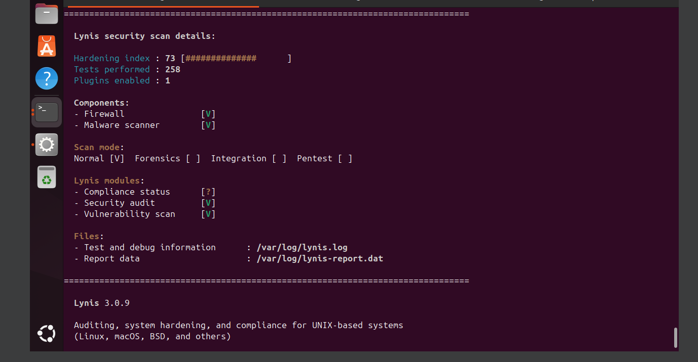
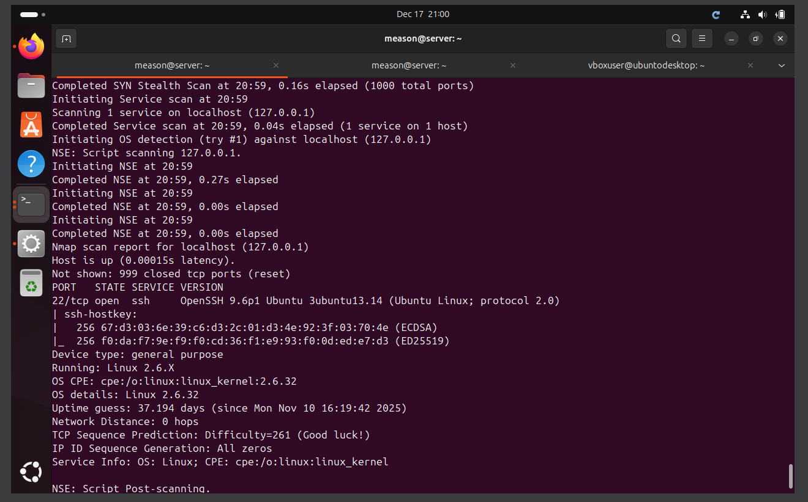
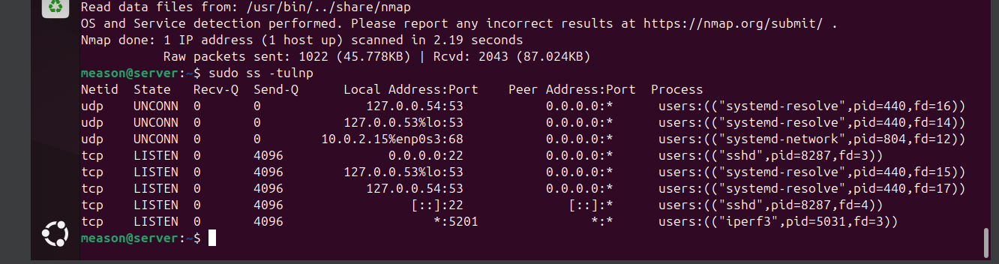
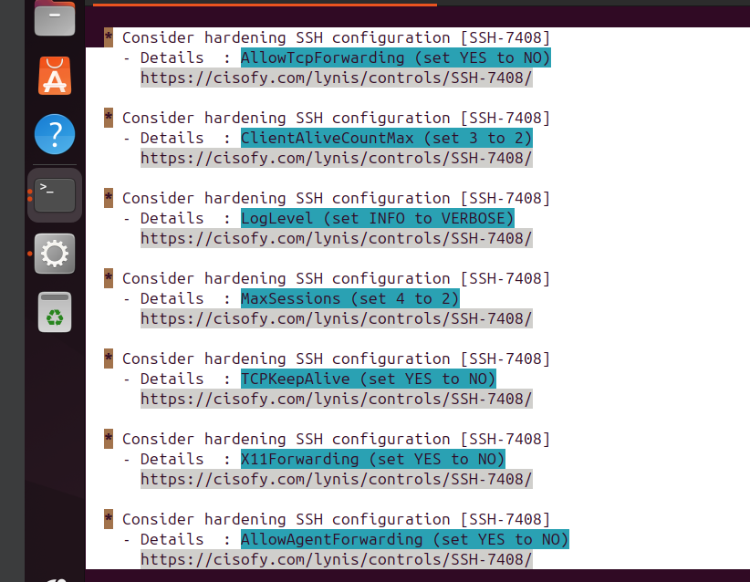

# Security Audit and System Evaluation
## Automated Security Auditing (Lynis Baseline)
To get an objective measure of my server's security, I ran an initial scan using Lynis, an open-source security auditing tool.
The Thinking: I needed a quantitative "Hardening Index" to identify blind spots that my manual configuration might have missed.
Initial State: My first scan resulted in a hardening index of 66. While this showed a decent foundation, the audit flagged several areas for improvement, particularly regarding the malware scanner and specific service configurations.
Improved State: After performing the remediations suggested by the tool, I ran the audit again and successfully raised my score to 73. This increase represents a significantly reduced attack surface and a more resilient operating system.

## Targeted SSH Remediation Strategy
Lynis provided a specific list of SSH hardening suggestions that I used to further secure the remote access point.
The Changes I Made:
AllowTcpForwarding & X11Forwarding set to NO: I disabled these to prevent attackers from using my SSH connection to tunnel other malicious traffic or exploit graphical vulnerabilities.
MaxSessions & ClientAliveCountMax reduced: I lowered these values to limit the duration and number of concurrent administrative sessions, reducing the "window of opportunity" for an active session hijack.
LogLevel set to VERBOSE: I increased the logging detail to ensure that any suspicious login patterns are captured in the system logs for later analysis.

## Network Security and Attack Surface Assessment
I performed a network scan using Nmap to see exactly what a potential attacker would see when looking at my server from the outside.
The Thinking: A server is only as secure as its "quietest" port. I needed to ensure that my UFW firewall was successfully cloaking everything except essential services.
The Result: The Nmap scan confirmed that only Port 22 (SSH) is open. The scan accurately identified the service as OpenSSH 9.6p1 and correctly detected the underlying Linux kernel. This confirms that my network perimeter is tight and no unintended "backdoors" are exposed to the network.

## Service Inventory and Justification
I used the ss -tulnp command to perform a service audit, ensuring that every running process has a valid administrative reason to exist.
The Inventory:
systemd-resolve (Port 53): Justified as the local DNS resolver required for the server to resolve hostnames.
sshd (Port 22): Justified as the primary (and only) method for secure remote administration.
iperf3 (Port 5201): Identified during the audit. My Thinking: This tool was used for the performance testing in Week 6. Now that the audit is complete, my next step is to disable this service to maintain a "minimalist" security posture.

## Final Configuration Verification
To wrap up the audit, I ran my custom security-baseline2.sh script to verify that my manual edits to sshd_config remained intact after the Lynis remediations.
Verification:
PasswordAuthentication: Still set to NO (Secure).
PubkeyAuthentication: Still set to YES (Secure).
PermitRootLogin: Still set to NO (Secure).
The Result: The script confirms that my core security "anchors" are still in place, providing a final layer of confidence in the server's integrity.

## all images below:
### Before system hardening:
  

### After system hardening:
  

### Scan nmap:
  

### service Inventory
  

### Updates Made for Hardening:
  
